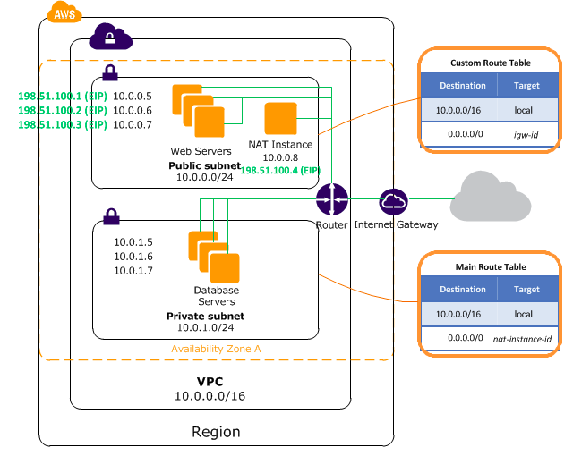

# Creating VPC with public and private subnets via CloudFormation
* Go to AWS console and navigate to CloudFormation service
* Choose to `Create New Stack`
* Choose `Create Template with Designer`

# Diagram

